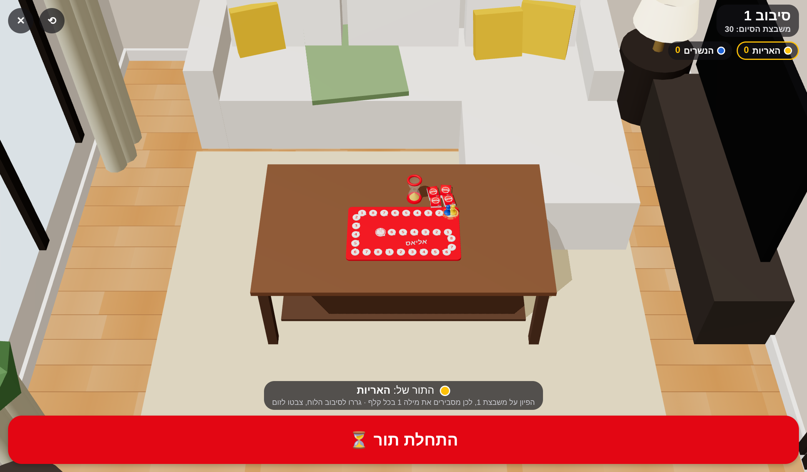

# אליאס – Alias (Hebrew)

A digital, Hebrew-only, right-to-left version of the family word game **אליאס**, built with React Native, Expo (SDK 57) and TypeScript.

<p>
  
  
  
  
  
  
</p>

## How to play (איך משחקים)

- 4–12 players split into 2–6 teams.
- On each turn one player explains as many words as possible before the sand timer runs out (60 seconds by default).
- Every card has 8 numbered words. The number (1–8) of the square your pawn stands on says which word on each card you explain.
- The explainer may use synonyms, antonyms, hints and associations, but may **never** say the word or any part of it.
- Every correct word is one step forward on the board. The first team to reach the finish square wins.
- When time runs out, every team can guess the last word on screen. Tap the team that guessed it (or "אף אחד") and that team moves one step forward.
- Optional classic rule: a skipped word moves the team one step back.

## Run it

```bash
npm install
npx expo start          # then scan the QR code with Expo Go, or press a / i / w
```

### Bootstrap from scratch (how this project was created)

```bash
npx create-expo-app@latest alias-hebrew --template blank-typescript
cd alias-hebrew
npx expo install expo-localization expo-haptics react-native-safe-area-context
npx expo install react-dom react-native-web @expo/metro-runtime   # optional: web support
```

Then copy in `App.tsx`, `index.ts`, `app.json`, `vercel.json` and the `src/` and `public/` folders from this repository.

## Deploy the web version to Vercel

`vercel.json` builds the app as a static web app (`npx expo export --platform web` → `dist/`).

- **From the dashboard:** vercel.com → Add New → Project → import the GitHub repo → Deploy. No settings need changing; `vercel.json` provides the install and build commands and the output folder.
- **From a terminal:** run `npx vercel --prod` in the repository root.

`public/index.html` is the web page template (`lang="he" dir="rtl"`, red background, Hebrew title).

## The 3D table

After setup, the whole game is played on one full-screen 3D table (three.js through `@react-three/fiber`, `expo-gl` on phones). Each phase only swaps the panels over it:

- **Board:** raised speech-bubble squares numbered **1–8 over and over**, a glowing start and the ✌ finish. The spiral track is sized to the chosen finish square (20–50).
- **Camera:** drag with a finger or the mouse to orbit around the board; pinch or use the mouse wheel to zoom. The camera always aims at the middle of the table and keeps the whole table in view in the space between the panels, from any angle. ⟲ resets the view.
- **Sand timer = turn clock:** when a turn starts it flips over, then the sand runs from the top bulb to the bottom for exactly the turn length. The clock starts once the flip finishes.
- **Cards:** a card lifts off the deck and flies up, then appears at the bottom of the screen with its 8 words. The team's word (by square number) is big on a red band. נכון / דלג send it away and the next card rises.
- **Living room:** the board sits on a coffee table in a 3D living room (wood floor, rug, sofas, pictures, lamps, a curtained window, TV, plant). Walls between the camera and the table disappear, so orbiting never hides the board. Zoom out to see the whole room.
- **Turn status:** no top bar during a turn. The seconds, ✓ / ↷ counts, points and pause float to the right of the card.
- **Pawns:** each team's pawn hops square by square after every turn. The next team has a glowing ring, and the winner's pawn dances.

Textures (number discs, logo, card backs, wood floor) live in `assets/3d/`. They are generated by `node scripts/make-textures.mjs`, which needs Playwright.

## RTL (right-to-left)

RTL is applied in three layers so it holds in every environment:

1. **`app.json`**: the `expo-localization` plugin sets `supportsRTL` and `forcesRTL`, so dev and production builds start in RTL.
2. **`index.ts`**: calls `I18nManager.allowRTL(true)` and `I18nManager.forceRTL(true)` at startup. In Expo Go this takes effect from the next launch.
3. **`App.tsx`**: the root view has `direction: 'rtl'`, so the layout is right-to-left from the very first frame, including on web.

## Folder structure

```
alias-hebrew/
├── App.tsx                     # Setup screen, then the full-screen game stage
├── index.ts                    # Entry point, forces RTL
├── app.json                    # Expo config (red splash, RTL plugin)
├── scripts/make-textures.mjs   # Renders the 3D textures in assets/3d/
└── src/
    ├── theme.ts                # Red and white palette, team pawn colours
    ├── data/words.ts           # Hebrew word bank (~470 words → 8-word cards)
    ├── game/
    │   ├── types.ts            # GameState, Team, actions
    │   ├── gameReducer.ts      # All game rules: cards, turns, scoring, winning
    │   └── GameContext.tsx     # useReducer + React context
    ├── hooks/useCountdown.ts   # Drift-free countdown with pause and start delay
    ├── three/
    │   ├── Board3D.tsx         # 3D table: board, pawns, decks, sand timer, card flight, orbit camera
    │   ├── LivingRoom.tsx      # Living room and coffee table around the board
    │   └── boardLayout.ts      # Spiral track geometry for any finish square
    ├── components/
    │   ├── AliasLogo.tsx       # Speech-bubble logo
    │   ├── BigButton.tsx
    │   └── WordCard.tsx        # Animated 8-word card
    └── screens/
        ├── SetupScreen.tsx     # Teams (2–6), finish square, turn length, rules, live 3D preview
        └── stage/
            ├── GameStage.tsx   # Full-screen 3D table + the panel for the current phase
            ├── ScoreboardPanel.tsx
            ├── TurnPanel.tsx   # Sand-timer clock, cards, נכון / דלג, last word
            ├── SummaryPanel.tsx
            └── WinnerPanel.tsx
```

## Game flow

`setup → scoreboard → turn → summary → scoreboard → … → winner`

All state lives in a single reducer (`src/game/gameReducer.ts`):

- **Deck**: the word bank is dealt onto shuffled 8-word cards once per game and drawn without repeats. When the deck runs out it is dealt again.
- **Turn switching**: after each confirmed turn, play passes to the next team. The round counter goes up when play returns to the first team.
- **Scoring**: +1 per correct word (and optionally −1 per skip). The last word gives +1 to whichever team guessed it, and is never penalised. Positions are clamped between 0 and the finish square.
- **Winning**: a team that reaches the finish square wins immediately. If the explaining team and a team that stole the last word both reach it in the same turn, the explaining team wins.

## Adding words

Add strings to `RAW_WORDS` in `src/data/words.ts`. Duplicates are removed automatically.
