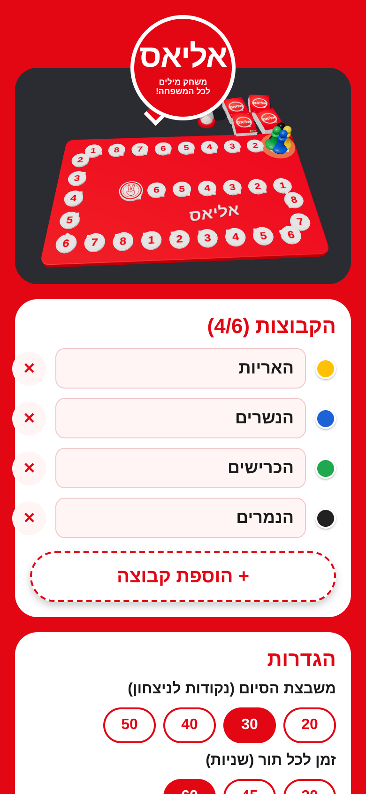
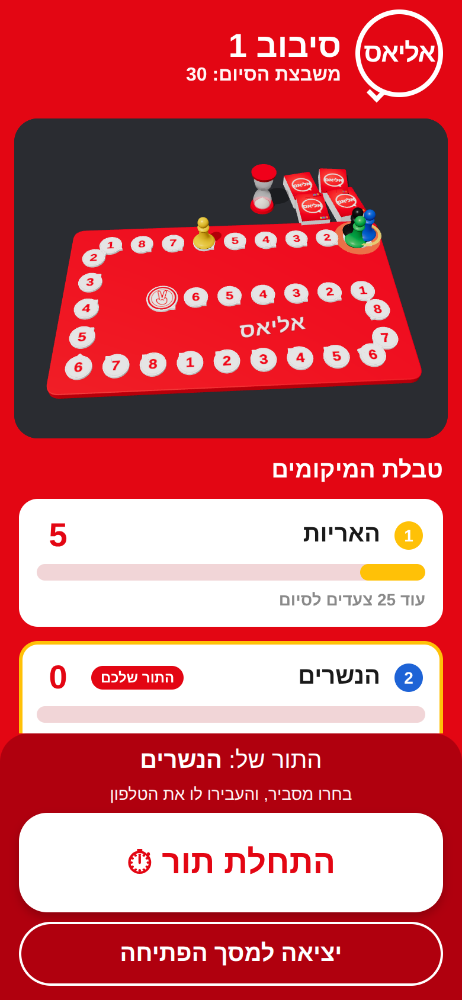
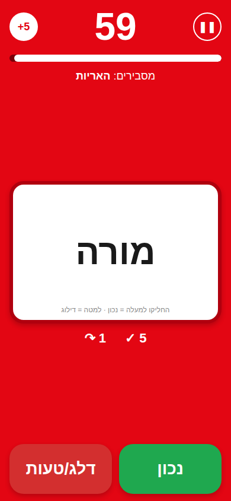
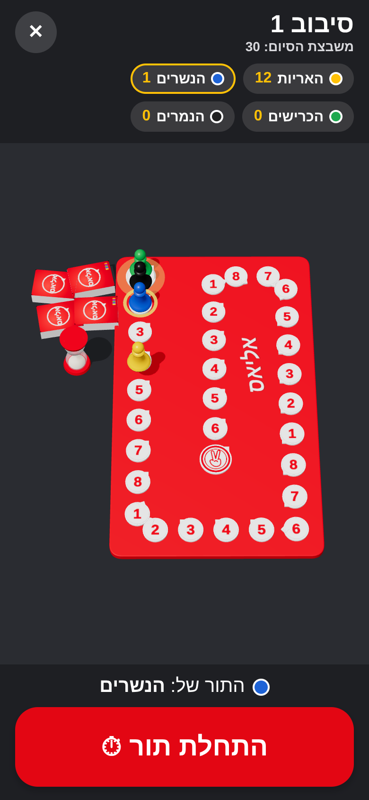
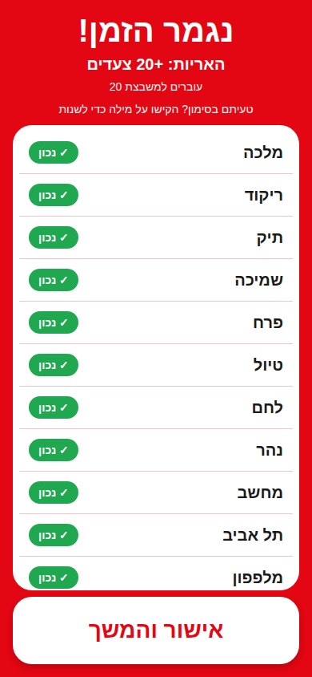

# אליאס – Alias (Hebrew)

A digital, Hebrew-only, right-to-left version of the family word game **אליאס**, built with React Native, Expo (SDK 57) and TypeScript.

<p>
  
  
  
  
  
</p>

## How to play (איך משחקים)

- 4–12 players split into 2–6 teams.
- On each turn one player explains as many words as possible before the timer runs out (60 seconds by default).
- The explainer may use synonyms, antonyms, hints and associations, but may **never** say the word or any part of it.
- Every correct word is one step forward on the board. The first team to reach the finish square wins.
- When time runs out, every team can guess the last word on screen. Tap the team that guessed it (or "אף אחד") and that team moves one step forward.
- Optional classic rule: a skipped word moves the team one step back.

## Run it

```bash
npm install
npx expo start          # then scan the QR code with Expo Go, or press a / i / w
```

### Bootstrap from scratch (how this project was created)

```bash
npx create-expo-app@latest alias-hebrew --template blank-typescript
cd alias-hebrew
npx expo install expo-localization expo-haptics react-native-safe-area-context
npx expo install react-dom react-native-web @expo/metro-runtime   # optional: web support
```

Then copy in `App.tsx`, `index.ts`, `app.json`, `vercel.json` and the `src/` and `public/` folders from this repository.

## Deploy the web version to Vercel

`vercel.json` builds the app as a static web app (`npx expo export --platform web` → `dist/`).

- **From the dashboard:** vercel.com → Add New → Project → import the GitHub repo → Deploy. No settings need changing; `vercel.json` provides the install and build commands and the output folder.
- **From a terminal:** run `npx vercel --prod` in the repository root.

`public/index.html` is the web page template (`lang="he" dir="rtl"`, red background, Hebrew title).

## The 3D board

The board is a real-time 3D scene (three.js through `@react-three/fiber`, `expo-gl` on phones):

- A red board with raised white speech-bubble squares numbered **1–8 over and over**, as on the printed board, a glowing start square and the ✌ finish disc.
- A spiral track sized to the chosen finish square (20–50).
- Pawns in each team's colour hop square by square after every turn. The team whose turn is next has a glowing ring, and the winner's pawn bounces.
- Card decks and a sand timer beside the board.
- Tap the board on the scoreboard to open it full screen. On a portrait phone the board turns lengthwise, with the standings, whose turn it is and the start button shown over it.

Textures (number discs, logo, card backs) live in `assets/3d/`. They are generated by `node scripts/make-textures.mjs`, which needs Playwright.

## RTL (right-to-left)

RTL is applied in three layers so it holds in every environment:

1. **`app.json`**: the `expo-localization` plugin sets `supportsRTL` and `forcesRTL`, so dev and production builds start in RTL.
2. **`index.ts`**: calls `I18nManager.allowRTL(true)` and `I18nManager.forceRTL(true)` at startup. In Expo Go this takes effect from the next launch.
3. **`App.tsx`**: the root view has `direction: 'rtl'`, so the layout is right-to-left from the very first frame, including on web.

## Folder structure

```
alias-hebrew/
├── App.tsx                     # Providers + chooses the screen from the game phase
├── index.ts                    # Entry point, forces RTL
├── app.json                    # Expo config (red splash, RTL plugin)
└── src/
    ├── theme.ts                # Red and white palette, team pawn colours
    ├── data/words.ts           # Hebrew word bank (~150 words)
    ├── game/
    │   ├── types.ts            # GameState, Team, actions
    │   ├── gameReducer.ts      # All game rules: turns, scoring, deck, winning
    │   └── GameContext.tsx     # useReducer + React context
    ├── hooks/useCountdown.ts   # Drift-free countdown timer with pause
    ├── three/
    │   ├── Board3D.tsx         # 3D board scene: discs, pawns, decks, timer, camera
    │   └── boardLayout.ts      # Spiral track geometry for any finish square
    ├── components/
    │   ├── AliasLogo.tsx       # Speech-bubble logo
    │   ├── BigButton.tsx
    │   └── TeamProgress.tsx    # Score, progress bar, steps left to the finish
    └── screens/
        ├── SetupScreen.tsx     # Teams (2–6), target, turn length, rules
        ├── ScoreboardScreen.tsx# Digital board between turns, who plays next
        ├── GameScreen.tsx      # Timer, word card, נכון / דלג/טעות (+ swipe)
        ├── TurnSummaryScreen.tsx # Review and correct the turn's words
        └── WinnerScreen.tsx
```

## Game flow

`setup → scoreboard → turn → summary → scoreboard → … → winner`

All state lives in a single reducer (`src/game/gameReducer.ts`):

- **Deck**: the word bank is shuffled once per game and drawn without repeats. When the deck runs out it is reshuffled.
- **Turn switching**: after each confirmed turn, play passes to the next team. The round counter goes up when play returns to the first team.
- **Scoring**: +1 per correct word (and optionally −1 per skip). The last word gives +1 to whichever team guessed it, and is never penalised. Positions are clamped between 0 and the finish square.
- **Winning**: a team that reaches the finish square wins immediately. If the explaining team and a team that stole the last word both reach it in the same turn, the explaining team wins.

## Adding words

Add strings to `RAW_WORDS` in `src/data/words.ts`. Duplicates are removed automatically.
